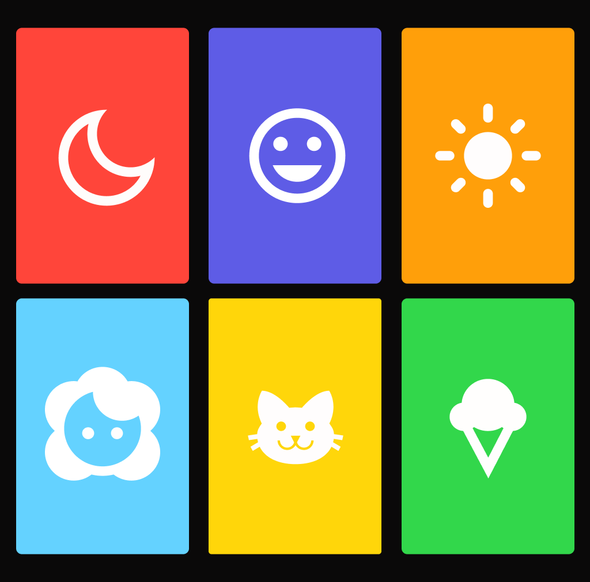
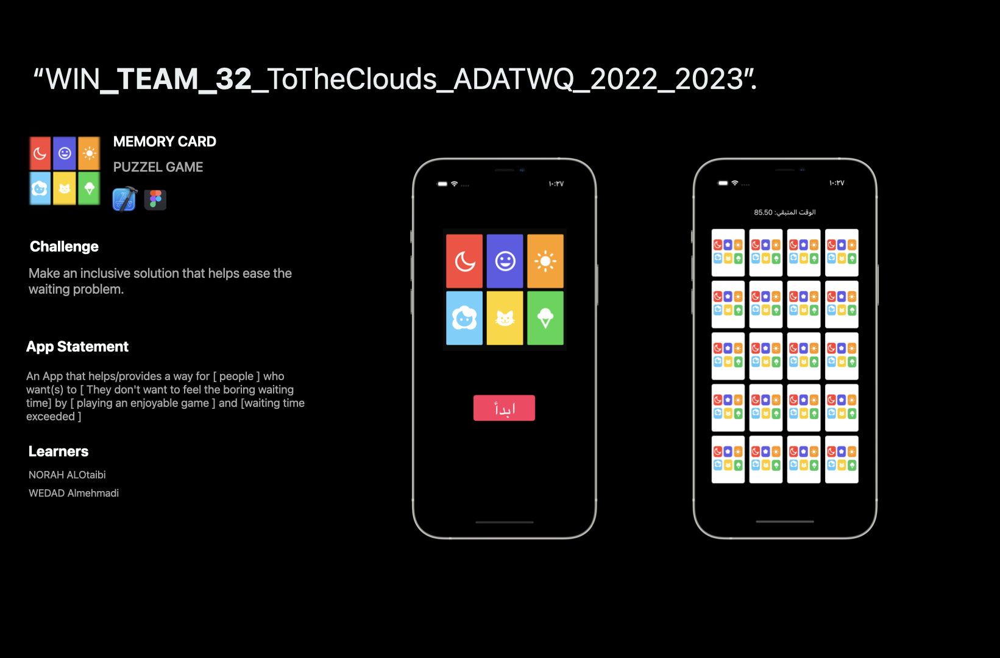

<!-- PROJECT LOGO -->

<h3>   Memory Cards  
<a href="https://drive.google.com/file/d/17nM08Fod8Gd4V49iJvUz13qBfooxK30L/view?usp=sharing">Test-Flight</a>      </h3>   
 
   
 
<a href="https://files.fm/u/weuu4hngb">Demo</a>   <a href="https://testflight.apple.com/join/UnQ6R5R6"
## Overveiw

<video src="https://drive.google.com/file/d/1jhqD3NLq1ruabJON4HXeXB5yQlgDmdWS/view?usp=sharing" controls="controls" style="max-width: 730px;">
</video>

### Big Idea
Inclusion.

### Challenge Statment
Make an inclusive solution that helps ease the waiting problem.

### Solution Concept
A game for people who don't want to feel a boring time to enjoy, so the games will help that.

### Accessibility Included
- Voice controle
- Design UI for blind color people

### Language Support
- Arabic
- English

### Tools
[![Swift][Swift-img]][Swift-url]   [![Figma][Figma-img]][Figma-url]

## Challenge Summary

## Success Criteria
- Project is completed on time ✅
- Design an app that considers human diversity ✅
- Design interfaces that support both LTR - RTL languages ✅
- Localize your app to support multiple languages ✅
- Build an app that supports Apple’s built-in accessibility settings ✅

## Team
#### WIN
<a href="https://www.linkedin.com/in/wedad-almehmadi-701476200/">Wedad Almehmadi</a> - <a href="https://www.linkedin.com/in/norah-alotaibi-0a34a3252/">Norah Alotaibi</a> 

<!-- MARKDOWN LINKS & IMAGES -->
<!-- https://www.markdownguide.org/basic-syntax/#reference-style-links -->
[Swift-img]: https://img.shields.io/badge/-Swift-orange
[Swift-url]: https://developer.apple.com/swift/

[Figma-img]: https://img.shields.io/badge/-Figma-blue
[Figma-url]: https://www.figma.com/file/c9Huf9Kh7N93zwRb7sR04U/Memory?node-id=0%3A1

